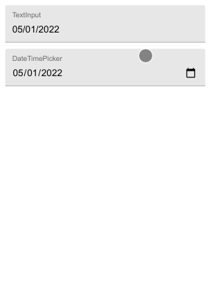

react-native-paper-datetimepicker
=================================

**A React Native Paper TextInput for picking date or time**

* In Android and iOS, the DateTimePicker component is a non-editable TextInput
  wrapped by a TouchableRipple. When the touchable is clicked, the component
  uses [Matteo Mazzarolo](https://github.com/mmazzarolo)'s
  [react-native-modal-datetime-picker](https://github.com/mmazzarolo/react-native-modal-datetime-picker)
  to change the input value.

  The code was heavily inspired by [Fateh
  Farooqui](https://github.com/fateh999)'s
  [react-native-paper-dropdown](https://fateh999.github.io/react-native-paper-dropdown/#/)
  and [my own fork of
  it](https://github.com/hashiprobr/react-native-paper-dropdown).

* In the web, the DateTimePicker component is an `input[type="date"]` or
  `input[type="time"]` wrapped by a TextInput. The value can either be typed or
  chosen from a popup.

  
  


Install
-------

With npm:

```
npm install @hashiprobr/react-native-paper-datetimepicker
```

With yarn:

```
yarn add @hashiprobr/react-native-paper-datetimepicker
```

If using Expo, add the module to `webpack.config.js`:

``` js
const createExpoWebpackConfigAsync = require('@expo/webpack-config');

module.exports = async function (env, argv) {
    const config = await createExpoWebpackConfigAsync({
        ...env,
        babel: {
            dangerouslyAddModulePathsToTranspile: [
                '@hashiprobr/react-native-paper-datetimepicker',
            ]
        },
    }, argv);
    return config;
};
```

If `webpack.config.js` does not exist, create it with:

```
expo customize:web
```


Props
-----

| name                 | description |
|----------------------|-------------|
| type                 | `'date'` or `'time'` (default `'date'`) |
| value                | the current date |
| onChangeDate         | called when the date has changed |
| disabled             | equivalent to the [TouchableRipple disabled prop](https://callstack.github.io/react-native-paper/touchable-ripple.html#disabled) and the [TextInput disabled prop](https://callstack.github.io/react-native-paper/text-input.html#disabled) |
| onFocus              | equivalent to the [TouchableRipple onFocus prop](https://callstack.github.io/react-native-paper/touchable-ripple.html#onFocus) |
| onBlur               | equivalent to the [TouchableRipple onBlur prop](https://callstack.github.io/react-native-paper/touchable-ripple.html#onBlur) |
| style                | all properties except margins are applied to the inner TextInput, margins are applied to the outer TouchableRipple |
| theme                | equivalent to the [TouchableRipple theme prop](https://callstack.github.io/react-native-paper/touchable-ripple.html#theme) and the [TextInput theme prop](https://callstack.github.io/react-native-paper/text-input.html#theme) |
| editable             | if false, clicking on the component has no effect (default `true`) |
| borderless           | equivalent to the [TouchableRipple borderless prop](https://callstack.github.io/react-native-paper/touchable-ripple.html#) |
| background           | equivalent to the [TouchableRipple background prop](https://callstack.github.io/react-native-paper/touchable-ripple.html#background) |
| centered             | equivalent to the [TouchableRipple centered prop](https://callstack.github.io/react-native-paper/touchable-ripple.html#centered) |
| rippleColor          | equivalent to the [TouchableRipple rippleColor prop](https://callstack.github.io/react-native-paper/touchable-ripple.html#rippleColor) |
| underlayColor        | equivalent to the [TouchableRipple underlayColor prop](https://callstack.github.io/react-native-paper/touchable-ripple.html#underlayColor) |
| touchableStyle       | all properties except margins are applied to the outer TouchableRipple |
| mode                 | equivalent to the [TextInput mode prop](https://callstack.github.io/react-native-paper/text-input.html#mode) |
| label                | equivalent to the [TextInput label prop](https://callstack.github.io/react-native-paper/text-input.html#label) |
| error                | equivalent to the [TextInput error prop](https://callstack.github.io/react-native-paper/text-input.html#error) |
| selectionColor       | equivalent to the [TextInput selectionColor prop](https://callstack.github.io/react-native-paper/text-input.html#selectionColor) |
| underlineColor       | equivalent to the [TextInput underlineColor prop](https://callstack.github.io/react-native-paper/text-input.html#underlineColor) |
| activeUnderlineColor | equivalent to the [TextInput activeUnderlineColor prop](https://callstack.github.io/react-native-paper/text-input.html#activeUnderlineColor) |
| outlineColor         | equivalent to the [TextInput outlineColor prop](https://callstack.github.io/react-native-paper/text-input.html#outlineColor) |
| activeOutlineColor   | equivalent to the [TextInput activeOutlineColor prop](https://callstack.github.io/react-native-paper/text-input.html#activeOutlineColor) |
| dense                | equivalent to the [TextInput dense prop](https://callstack.github.io/react-native-paper/text-input.html#dense) |
| iconColor            | equivalent to the [TextInput.Icon color prop](https://callstack.github.io/react-native-paper/text-input-icon.html#color) |
| iconStyle            | equivalent to the [TextInput.Icon style prop](https://callstack.github.io/react-native-paper/text-input-icon.html#style) |
